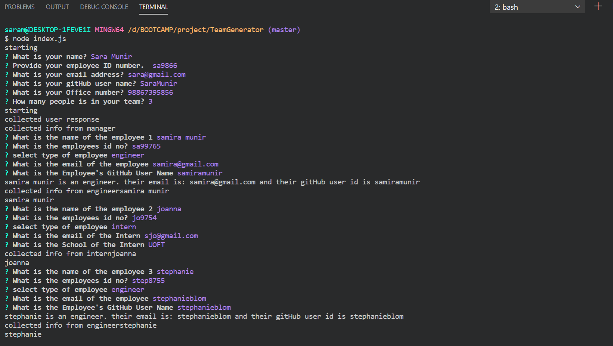

# Team Generator
The goal is to build a software engineering team generator command line application. The application will prompt the user for information about the team manager and then information about the team members. The user can input any number of team members, and they may be a mix of engineers and interns. 

## HOW IT WORKS
I used the Inquirer npm package to prompt the user for their email, id, and specific information based on their role with the company. For instance, an intern may provide their school, whereas an engineer may provide their GitHub username.

The app is run as a Node CLI to gather information about each employee.

## INSTALLATION
to run this app, the Inquirer npm package must be installed. 

## EXAMPLE
### Cli example screenshot
.

### Generated html screenshot
.
